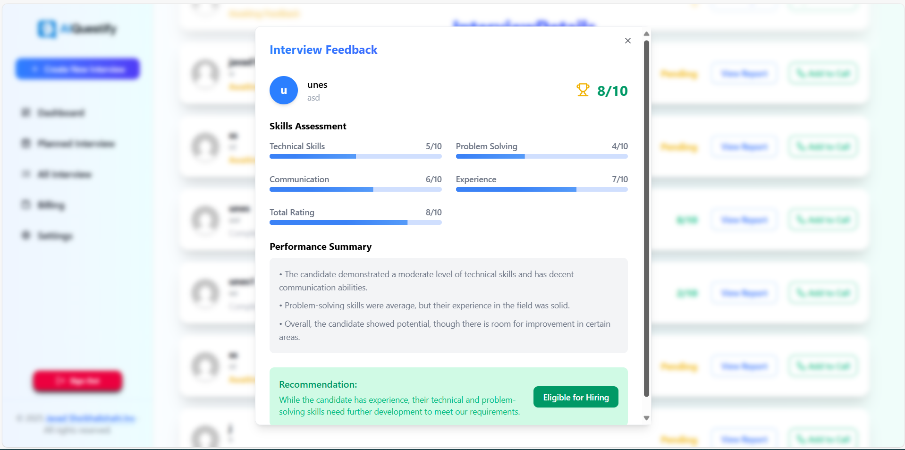

# AIQuestify 🎙️🚀

**AIQuestify** is a smart AI-powered interview platform that helps users practice and evaluate their interview skills in real-time. Built with Supabase, Vercel, and modern web technologies, it offers a seamless login experience, real-time feedback, and voice-enabled interactions using GPT.


---

## 🌟 Features

- 🔐 **Google OAuth Login** via Supabase Auth
- 🎤 **AI-Powered Voice Interviews** (Supports English)
- 🧠 **GPT-Based Questioning & Evaluation**
- 📊 **Real-Time Feedback & Results**
- 🖼️ **Modern UI with TailwindCSS & Lucide Icons**
- 🌐 **Fully Responsive** on all screen sizes
- 👥 **Face-to-Face Interview Mode** with interview links
- 📧 **Confirmation Emails** upon interview creation
-  **Two Payment Method** upon interview creation
-    
---

## 📸 Preview

### 🔐 Login with Google
> Simple and secure Google OAuth login flow powered by Supabase.


---

### 🎤 Interview Mode (English)
> AI-generated questions and voice interaction using GPT.


---

### 📊 Real-Time Feedback
> Smart scoring and feedback after each interview session.



---

### 🧑‍💼 Candidate Dashboard
> Manage past sessions, view progress, and get suggestions.


---

### ⚙️ Payment Page
> Toggle app features, set language preferences, and more.


---

## 💼 Face-to-Face Interviews

AIQuestify also supports **Face-to-Face Interviews** with the ability to generate a **shareable interview link**. This allows you to invite candidates to an actual live interview. Here’s how it works:

1. **Schedule an Interview**: Once you create an interview, the platform generates a unique link for the interview session.
2. **Share the Link**: Share this link with candidates via email, message, or any communication platform.
3. **Join the Interview**: Both the interviewer and candidate can join the interview by clicking on the link, initiating the live session.
4. **Real-time Interaction**: During the interview, both parties can communicate, and the interviewee will be evaluated in real-time based on their responses.

---

📧 Interview Confirmation Emails
Once an interview is created and the link is generated, AIQuestify sends a confirmation email to candidate via share. This email contains:

A link to the interview session

The scheduled time and date of the interview

Any additional instructions or information

Payment Confirmation: after success Payment send Confirmation email for user.

This ensures that both parties are prepared, reminded about the session, and have a clear understanding of the payment status before the session begins.

---

## ⚙️ Tech Stack

| Tech        | Description                              |
|-------------|------------------------------------------|
| **Next.js** | React Framework for SSR and SSG          |
| **Supabase**| Auth, DB, and storage (PostgreSQL)       |
| **TailwindCSS** | Rapid UI styling                     |
| **Lucide Icons** | Icon library for modern design      |
| **Vercel**  | Deployment & hosting                     |
| **OAuth**   | Google Sign-In via Supabase              |
| **Email**   | Confirmation emails sent via NodeMailer  |
| **Resend**   | Confirmation emails sent via NodeMailer  |

---

## 🚀 Getting Started

### 1. Clone the repository

```bash
git clone https://github.com/your-username/aiquestify.git
cd aiquestify

2. Install dependencies
npm install

3. Set environment variables
NEXT_PUBLIC_SUPABASE_URL=https://your-project.supabase.co
NEXT_PUBLIC_SUPABASE_ANON_KEY=your-anon-key
NEXT_PUBLIC_APP_URL=http://localhost:3000
EMAIL_SERVICE_API_KEY=your-email-service-api-key

4. Run locally
npm run dev
Open http://localhost:3000 in your browser.

📦 Deployment
This project is deployed on Vercel:

Connect your GitHub repo to Vercel

Add environment variables in the Vercel dashboard

Push code to main and you're live 🎉

👨‍💻 Author
Created with ❤️ by Javad Sheikhalishahi

📝## License
Distributed under the MIT License. See LICENSE for more information.
